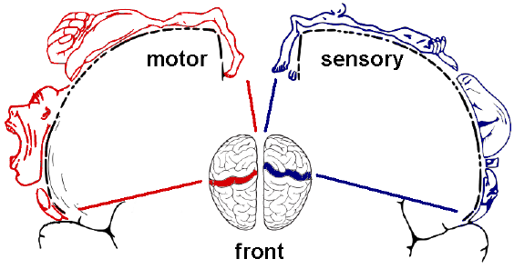

Random Forest and SVM classifiers now usе a CPU

`data` folder - store raw EEG data in .txt format

1. Run `main_preparation.py` inside `DataPreparation` folder, it creates file with processed raw data for classifier fitting
2. Run `RandomForest_main.py` inside `RandomForest` folder, it fit classifier and save it inside `models` folder

Classes: 
0 = кнопка не нажата 
1 = кнопка нажата левой 
2 = кнопка нажата правой
 
### Random Forest Classifier ###

`CV_RandomForest.py` **Parameters** obtained using a cross-validation parameters grid search.
> Mark's dataset (*whole dataset was used*)

*3 folds* for cross-validation were used and *n_iter=20* 

`Best Params: 
{"n_estimators": 2000, "min_samples_split": 2, "min_samples_leaf": 2, "max_features": "auto", "max_depth": 50, "bootstrap": false}
Best Accuracy: 
0.9799830842965886`

> Kate's dataset (*data = data.loc[500:150000]*)

*3 folds* for cross-validation were used and *n_iter=7* 

`Best Params:
{'n_estimators': 1000, 'min_samples_split': 10, 'min_samples_leaf': 1, 'max_features': 'sqrt', 'max_depth': 70, 'bootstrap': False}
Best Accuracy:
0.9806521739130435`

### Plots ###
Plots are stored in `Plots` folder
1. Average precision score plot
2. Extension of Precision-Recall curve to multi-class plot 

**_Color - Class_**
For Extension of Precision-Recall curve to multi-class plot 
- Class 0 - Navy color
- Class 1 - Darkorange color
- Class 2 - Green color
- Average precision score line - Gold color

## Before running DataPreparation ##

- Set `BASE_DIR` in `config.py`

## Before running prediction ##

- Check which model is imported (variable: ___model___)
- Check data imported for prediction (variable: ___data___)
- Check channels on which classes are predicted (variable: ___channels___). To get
channels with highest variance - run `variance.py` inside `Channel_selection` folder

### Alternative GPU classifiers ###
1. KNn - have GPU implementation, but now the CPU is used.
 
    _TODO: implement GPU learning_
2. CatBoost_Gradient - have GPU implementation. 

    _TODO: implement grid-search for parameters tuning_

3. XGBoost - have GPU implementation. 

    _TODO: implement grid-search for parameters tuning_
    
    

### EEG classification theory ###

1. Frequency ranges for motor imagery registration: _mu (8–12 Hz) and beta (13–28 Hz) [1]._ 
Signal modulation is focused over sensorimotor cortex and in the _alpha- and beta frequency bands_ associated with _mu rhythm activity_ [2].

2. 

__Sources:__

[1] https://www.ncbi.nlm.nih.gov/pmc/articles/PMC1989674/#R6
[2] https://www.bci2000.org/mediawiki/index.php/User_Tutorial:Introduction_to_the_Mu_Rhythm

